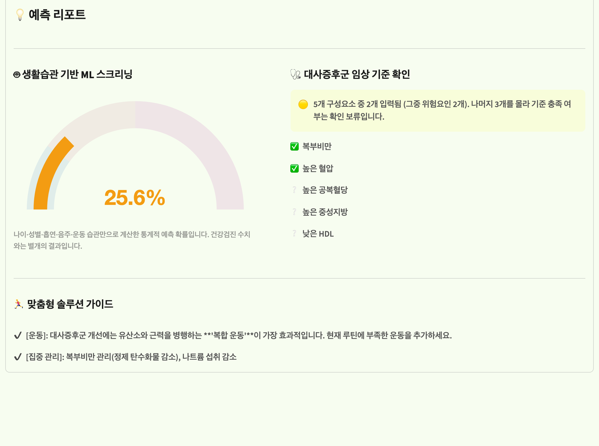

# 🩺 KNHANES 기반 청년층 대사증후군 위험 분석 및 예측

> **국민건강영양조사(KNHANES) 데이터를 활용해 20–39세 청년층의 대사증후군 관련 요인을 분석하고, 생활습관 기반 위험도 예측 서비스를 구현한 프로젝트입니다.**

---

## 🎬 시연 영상

[](https://youtube.com/shorts/TcNgaddpYXQ?feature=share)

---

## 📌 프로젝트 한눈에 보기

대사증후군은 허리둘레·혈압·혈당·중성지방·HDL 등 여러 건강지표를 함께 확인해야 판정할 수 있는 질환입니다.

이 프로젝트에서는 국민건강영양조사 데이터를 활용해 **청년층의 생활습관과 대사증후군의 연관성을 분석**하고, 나이·성별·흡연·음주·운동 정보만으로 위험도를 예측하는 ML 모델을 구현했습니다.

웹 서비스에서는 두 결과를 구분해서 제공합니다.

- 🤖 **생활습관 기반 ML 위험도 예측**
- 🩺 **건강검진 정보 기반 대사증후군 기준 충족 여부 확인**

| 항목 | 내용 |
|---|---|
| 데이터 | 국민건강영양조사(KNHANES) 제9기 (2022–2024) |
| 분석 대상 | 20–39세 청년층 3,363명 |
| 개발 기간 | 2026.04 (약 1개월), 6인 팀 |
| 통계 분석 | 복합표본(weight+strata+PSU) 로지스틱 회귀 |
| ML 모델 | RandomForest + Isotonic Calibration |
| Test ROC-AUC | 0.7122 |
| Test Recall | 0.654 |
| 서비스 | Streamlit |


---

## 👩‍💻 담당 역할

### 프로젝트 당시 — Data Analysis

- KNHANES 원시데이터 전처리 및 분석용 변수 생성
- 대사증후군 5개 구성요소와 약물 복용 보정 기준을 데이터 로직으로 구현
- 가중 기술통계 및 탐색적 검정 (`02_statistical_table.py`)
- 3단계 계층적 Logistic Regression, Adjusted OR·95% CI 산출, Forest Plot 시각화 (`05_forest_plot.py`)

> ML 모델링(`03_modeling.py`)과 최초 Streamlit 구현(`04_streamlit_app.py`)은 팀 내 TA 담당자 2인이 각각 수행했습니다.

### 🔧 프로젝트 종료 후 개인 개선

포트폴리오를 정리하며 전체 코드를 다시 검토했고, 통계분석과 ML 파이프라인에서 개선할 부분을 발견해 직접 수정했습니다.

**통계분석**
- KNHANES의 가중치·층화·집락을 모두 반영한 복합표본 분석으로 재검증
- 기존 분석 결과와 새 분석 결과가 거의 동일함을 확인

**ML**
- 범주형 변수를 고려하지 않은 일반 SMOTE → SMOTENC로 개선
- 오버샘플링이 교차검증 내부에서만 수행되도록 Pipeline 재구성
- Test set을 모델 선택에 사용하지 않도록 평가 절차 개선
- 평가한 모델과 Streamlit에서 사용하는 모델을 하나로 통일

**서비스**
- ML 예측과 임상 기준 판정을 분리
- '진단·확진' 표현을 '위험도 예측·기준 확인'으로 변경
- 학습이 완료된 모델을 joblib로 저장해 앱에서 그대로 사용

---

## 📊 주요 분석 결과

### 1. 운동습관과 대사증후군의 연관성

연령·성별·흡연·음주를 보정한 뒤에도 **운동그룹과 대사증후군 사이에 통계적으로 유의한 연관성**이 확인됐습니다.

- 운동그룹 전체 효과: **Wald F=11.06 (df=3, 495), p<0.001**
- 복합운동군(유산소+근력): **OR 0.398 (95% CI 0.279–0.569)**
- 근력운동만: **OR 0.378 (95% CI 0.208–0.686)**
- 유산소운동만: 유의하지 않음 (p=0.439)

운동을 하지 않는 군과 비교했을 때 복합운동군과 근력운동군에서 대사증후군 odds가 유의하게 낮게 나타났습니다. 다만 이 결과는 각 운동군을 '운동 안 함'과 비교한 값으로, 복합운동군과 근력운동군을 서로 직접 비교한 것은 아니라 두 운동 방식 중 어느 쪽이 더 낫다고는 말할 수 없습니다.

> 관찰자료 기반 분석이므로 운동이 대사증후군을 직접 감소시킨다는 인과관계로 해석하지 않았습니다.


### 2. 다른 생활습관 요인

- **현재흡연**: 비흡연군 대비 대사증후군 odds가 유의하게 높음 — `OR 1.692 (95% CI 1.241–2.307, p<0.001)`
- **음주**: 통계적으로 유의한 연관성이 확인되지 않음 (p=0.565)
- **연령**: 연령이 1세 증가할 때마다 odds가 유의하게 높아짐 — `OR 1.109 (95% CI 1.083–1.134, p<0.001)`
- **성별**: 남성이 여성 대비 odds가 유의하게 높음 — `OR 4.078 (95% CI 3.092–5.379, p<0.001)`


---

## 🤖 ML 위험도 예측

생활습관 정보만으로 대사증후군 위험도를 예측하기 위해 5개 분류 모델을 학습 데이터 내부 교차검증으로 비교했습니다 (test set은 모델 비교에 사용하지 않음).

| 모델 | CV ROC-AUC |
|---|---:|
| RandomForest | **0.7707** |
| CatBoost | 0.7704 |
| Logistic | 0.7686 |
| XGBoost | 0.7661 |
| LightGBM | 0.7647 |

상위 모델 간 성능 차이는 사실상 오차범위 안이었지만, 사전에 정한 **CV ROC-AUC 1위 모델을 선택하는 기준**에 따라 RandomForest를 최종 모델로 선정했습니다.

### 최종 Test 성능

| 지표 | 값 |
|---|---:|
| ROC-AUC | **0.7122** |
| Survey-weighted ROC-AUC | 0.7281 |
| Recall | 0.654 (threshold=0.114) |
| F1 | 0.2812 |
| Brier Score | 0.0994 |

> 기존 프로젝트 결과보다 일부 성능은 낮아졌지만, 데이터 누수를 방지하고 test set을 최종 평가에만 사용해 더 신뢰할 수 있는 평가 구조로 다시 측정한 결과입니다. 자세한 배경은 아래 "🔧 ML 파이프라인 리팩터링" 참고.

---

## 🌐 Streamlit 서비스

서비스에서는 **ML 예측과 임상 기준 확인을 서로 다른 결과로 제공**하며, 하나의 확률로 합치지 않습니다.

**🤖 생활습관 기반 ML 위험도**

```
입력: 연령 · 성별 · 흡연 · 음주 · 운동
    ↓
RandomForest 모델 (건강검진 수치는 사용하지 않음)
    ↓
대사증후군 예측 확률
```

**🩺 대사증후군 임상 기준 확인**

```
선택 입력: 허리둘레 · 혈압 · 공복혈당 · 중성지방 · HDL · 약물 복용 여부
    ↓
5개 대사증후군 구성요소 확인 (약물 복용 시 해당 항목 자동 반영)
    ↓
모든 정보 입력 → "n/5개 충족 → 기준 충족 / 미충족"
일부만 입력 → 확인 가능한 위험요인만 표시 + 나머지는 "확인 보류"
미입력      → 임상 기준 결과를 표시하지 않음
```



---

## 🔬 통계 분석 방법

> 여기부터는 분석 방법을 자세히 보고 싶은 경우를 위한 내용입니다.

### 대사증후군 변수 생성

다음 5개 구성요소 중 **3개 이상에 해당하면 대사증후군 기준 충족**으로 정의했습니다(대한비만학회 NCEP-ATP III 기준).

- 복부비만 · 높은 중성지방 · 낮은 HDL · 높은 혈압 · 높은 공복혈당

고혈압·이상지질혈증·당뇨 관련 약물을 복용하는 경우에는 검사값이 정상 범위더라도 해당 구성요소 판정에 약물 정보를 함께 반영했습니다(이상지질혈증 약은 중성지방·HDL 두 항목 모두에 반영 — KNHANES에 약물 계열을 세분화한 변수가 없어 데이터상 가능한 최선의 매핑).

### 복합표본 Logistic Regression

연구 질문: **연령·성별·흡연·음주를 고려한 뒤에도 운동습관과 대사증후군의 연관성이 나타나는가?**

세 단계로 변수를 추가했습니다.

- Model 1: 연령 + 성별
- Model 2: + 흡연 + 음주
- Model 3: + 운동그룹

프로젝트 종료 후 R `survey` 패키지를 이용해 KNHANES의 **가중치(weight), 층화(strata), 집락(PSU)**을 모두 반영해 재분석했습니다. 전체 KNHANES 원표본(전 연령, 20,191명)으로 survey design을 먼저 정의한 뒤, 20–39세 분석대상(3,363명)을 subpopulation으로 `subset()` 지정해 분석했습니다 — 20–39세만 먼저 잘라서 design을 만들면 그 하위표본에 없는 strata/PSU의 설계 정보가 사라져 분산추정이 편향될 수 있어, survey 패키지가 공식적으로 권장하는 방식입니다. 운동그룹 전체 효과는 일반 LRT 대신 **survey design을 고려한 Wald test**로 확인했습니다.

<details>
<summary>기술 상세 보기</summary>

- `svydesign(id=~psu, strata=~kstrata, weights=~wt_itvex, nest=TRUE)`
- `svyglm(metabolic_syndrome ~ ..., family=quasibinomial())`
- `regTermTest(model3, ~ex_1+ex_2+ex_3, method="Wald")`
- 원표본(전 연령) N=20,191에서 design 정의 → `subset(!is.na(metabolic_syndrome))`으로 analytic sample N=3,363 지정
- Train/Test 분할(ML용)과는 무관하게 분석 대상 전체를 사용 — ML은 "새로운 사람에 대한 예측력", 이 분석은 "표본 내 연관성"을 보는 것이므로
- var_weights 기반 Binomial GLM은 log-likelihood가 정의되지 않아 AIC·LRT가 부적절하다는 statsmodels 문서의 지적과 같은 이유로, 일반 AIC/LRT는 사용하지 않음

</details>

---

## 🔧 ML 파이프라인 리팩터링

<details>
<summary>왜 다시 만들었는지 자세히 보기</summary>

기존 팀 코드(`03_modeling.py`)를 다시 확인하면서 네 가지 문제를 발견했습니다.

**1. 범주형 변수 처리**
성별·흡연·음주·운동그룹은 숫자의 크기 자체에 의미가 없는 범주형 변수인데, 기존에는 정수값 상태로 일반 SMOTE가 적용되어 `exercise_group=1.64` 같은 실제로 존재하지 않는 중간 범주가 만들어질 수 있었습니다.
→ **SMOTENC를 사용해 범주형 구조를 유지하도록 수정**

**2. 교차검증과 SMOTE 순서**
기존에는 학습 데이터 전체에 SMOTE를 적용한 뒤 `RandomizedSearchCV(cv=5)`로 하이퍼파라미터를 탐색해, 각 validation fold에도 synthetic sample의 정보가 섞였습니다(leakage).
→ **각 CV 학습 fold 내부에서만 SMOTENC가 수행되도록 `imblearn.Pipeline` 구성**

**3. Test set 사용**
원 발표자료를 보면 기존 673명 test set은 최종 평가 1회가 아니라 5개 모델 × 3개 보정방식을 비교해 최종 모델(Logistic+Isotonic)을 **선택**하는 데 이미 사용됐습니다.
→ **전체 3,363명을 새로 stratified 8:2 분할하고, 모델 선택은 학습 데이터 CV에서만 수행**

**4. 평가 모델과 서비스 모델 불일치**
기존 `04_streamlit_app.py`는 평가했던 모델을 저장·로드하지 않고, 앱 실행 시 전체 데이터로 별도 재학습(SMOTE 없이, train/test 분리도 없이)했습니다.
→ **최종 모델을 `metabolic_risk_model.joblib`로 저장하고 Streamlit이 동일한 모델을 그대로 로드** (raw 입력 컬럼만 넣으면 전처리·추론이 한 파이프라인 안에서 처리됨)

</details>

---

## 💡 프로젝트에서 배운 점

**임상 지식을 데이터 규칙으로 변환**
대사증후군 구성요소와 약물 복용 기준을 코드로 구현하면서, 임상 진단 기준을 실제 분석 가능한 변수로 변환하는 작업을 경험했습니다.

**통계 분석과 예측 모델의 역할 구분**
계층적 Logistic Regression은 생활습관 요인과 대사증후군의 **연관성을 설명하는 분석**에, RandomForest는 새로운 사용자의 생활습관 정보를 이용한 **위험도 예측**에 사용했습니다. 같은 데이터라도 "왜 그런가"를 보는 도구와 "무엇이 나올까"를 보는 도구는 다르다는 걸 실제로 나눠보며 익혔습니다.

**결과보다 평가 과정의 신뢰성을 우선**
기존 모델보다 일부 성능지표가 낮아지더라도, 데이터 누수를 제거하고 학습·평가·서비스 모델을 일치시키는 것이 더 중요하다고 판단해 파이프라인을 다시 설계했습니다.

**기존 코드도 끝까지 검증**
직접 작성하지 않은 팀 코드까지 다시 따라가며 문제를 발견하고 수정하는 경험을 통해, 분석 결과뿐 아니라 결과가 만들어지는 과정의 신뢰성도 중요하다는 점을 배웠습니다.

---

## 🗂️ 프로젝트 구조

```
.
├── data/                          # 데이터 디렉토리 (gitignore 처리)
│   ├── hn_all.csv                 # 원본 KNHANES 데이터 (직접 다운로드 필요)
│   └── 0325_hn_all(med).csv       # 전처리 완료 데이터 (전처리 스크립트 실행 후 생성)
│
├── 01_data_processing.py       # 데이터 전처리
├── 02_statistical_table.py     # 기술통계 및 검정통계표 생성
├── 03_modeling.py              # ML 모델링, SHAP 분석 (팀 작성본, 원본 보존)
├── 04_streamlit_app.py         # 웹 서비스
├── 05_forest_plot.py           # 계층적 로지스틱 회귀 OR Forest Plot
├── 06_model_refactor.py        # (프로젝트 종료 후 개선) ML 파이프라인 리팩터링 + 재학습
├── 07_survey_analysis.R        # (프로젝트 종료 후 개선) 복합표본 설계(R survey) 재검증
├── feature_utils.py            # 06/04 공용 피처 인코딩 함수
├── metabolic_risk_model.joblib # 06에서 저장한 최종 모델 (04가 그대로 로드)
│
├── results/                    # README에 삽입된 결과 차트
├── requirements.txt
└── README.md
```

---

## ⚙️ 실행 방법

```bash
pip install -r requirements.txt      # KNHANES 원본은 질병관리청에서 직접 다운로드 후 data/ 에 위치
python 01_data_processing.py         # 전처리
streamlit run 04_streamlit_app.py    # 웹 서비스 (metabolic_risk_model.joblib, feature_utils.py 필요)
python 06_model_refactor.py          # ML 재학습 (선택)
Rscript 07_survey_analysis.R         # 복합표본 통계 재검증 (선택, R + survey 패키지 필요)
```

<details>
<summary>각 스크립트 상세 실행 순서 보기</summary>

**1단계 — 데이터 전처리**: `python 01_data_processing.py`
20–39세 필터링, 약물 복용군 포함(약물 보정 방식), 연속형 변수 윈저화(상하위 1%), 운동그룹/흡연상태/음주상태 파생변수 생성 → `data/0325_hn_all(med).csv` 출력

**2단계 — 검정통계표 생성**: `python 02_statistical_table.py`
복합표본 가중치(`wt_itvex`) 적용, 연속형은 가중 t-검정/범주형은 카이제곱 검정 → `data/hn_all_검정통계표.xlsx` 출력

**3단계 — 모델 학습 (Google Colab 권장)**: `03_modeling.py`를 Colab에서 실행
⚠️ 파일 상단 `load_and_setup_data()`의 `base_path`/`ORIG_PATH`는 팀 공유 드라이브 경로이므로 본인 환경으로 수정 필요

**4단계 — 웹 서비스 실행**: `streamlit run 04_streamlit_app.py`
`metabolic_risk_model.joblib`(6단계 산출물)과 `feature_utils.py`가 같은 폴더에 있어야 함

**5단계 — Forest Plot 생성 (선택)**: `python 05_forest_plot.py`
⚠️ 파일 상단 `DATA_PATH`는 개인 Google Drive 경로이므로 `0325_hn_all(med).csv` 경로로 수정 필요

**6단계 — ML 파이프라인 재학습 (선택)**: `python 06_model_refactor.py`
`data/0325_hn_all(med).csv`(3,363명 전체)를 새로 stratified 8:2 분할해 실행(팀의 기존 분할은 재사용하지 않음). 5개 후보 모델을 학습 데이터 CV로 비교 → 최종 모델 선정 → Isotonic 보정 → threshold 산출 → test set 평가까지 한 번에 수행하고 `metabolic_risk_model.joblib`을 저장.
macOS에서 XGBoost가 `libomp.dylib` 로드 오류를 낼 수 있으며 `brew install libomp`로 해결됩니다.

**7단계 — 복합표본 설계 재검증 (선택, R 필요)**: `Rscript 07_survey_analysis.R`
`install.packages("survey")` 필요. 입력 파일은 `data/0325_hn_all(med).csv`가 아니라 `data/hn_all_full_merged.csv`(원본 KNHANES 전체 표본에 파생변수를 `ID` 기준으로 합친 파일)이며, 아래처럼 만듭니다:
```python
full = pd.read_csv("data/hn_all.csv")[["ID","psu","kstrata","wt_itvex","age","sex"]]
sub = pd.read_csv("data/0325_hn_all(med).csv")[["ID","metabolic_syndrome","exercise_group","smoking_status","drinking_status"]]
full.merge(sub, on="ID", how="left").to_csv("data/hn_all_full_merged.csv", index=False)
```

</details>

---

## 📖 변수 정의 (데이터 사전)

<details>
<summary>전체 변수 정의 펼쳐보기</summary>

### 기본 인구학적 변수

| 변수명 | 설명 | 내용 |
|---|---|---|
| `sex` | 성별 | 1=남자, 2=여자 |
| `age` | 나이 | 만 나이(세), 20~39세만 사용 |

### 복합표본설계 변수

| 변수명 | 설명 | 내용 |
|---|---|---|
| `wt_itvex` | 건강설문·검진조사 가중치 | 복합표본 분석용 원본 가중치 |
| `w_norm` | 정규화 가중치 (파생) | `wt_itvex`를 표본 수에 맞춰 정규화 |
| `kstrata` | 층화변수 | 복합표본설계 층화 |
| `psu` | 1차 추출단위 | 복합표본설계 집락(PSU) |

### 운동 관련 변수

| 변수명 | 설명 | 내용 |
|---|---|---|
| `BE5_1` | 1주일간 근력운동 일수(원시) | 1~6=0~5일 이상, 8/9=비해당·무응답 → 3(2일) 이상이면 근력운동 실천 |
| `pa_aerobic` | 유산소 신체활동 실천율(원시) | 0=권장수준 미달, 1=충족(중강도 150분 또는 고강도 75분 이상) |
| `exercise_group` | 운동 그룹 분류(파생) | 1=복합(근력+유산소), 2=근력만, 3=유산소만, 4=둘 다 안 함 |

### 대사증후군 관련 변수

| 변수명 | 설명 | 측정단위 | 이상 기준 |
|---|---|---|---|
| `HE_wc` | 허리둘레(원시) | cm | 남 ≥90, 여 ≥85 |
| `HE_TG` | 중성지방(원시) | mg/dL | ≥150 |
| `HE_HDL_st2` | HDL 콜레스테롤(원시) | mg/dL | 남 <40, 여 <50 |
| `HE_sbp` | 수축기혈압(원시) | mmHg | ≥130 |
| `HE_dbp` | 이완기혈압(원시) | mmHg | ≥85 |
| `HE_glu` | 공복혈당(원시) | mg/dL | ≥100 |

| 변수명 | 설명 | 판정 기준(파생, 약물 보정 포함) |
|---|---|---|
| `ms_wc` | 복부비만 | `HE_wc` 기준 초과 |
| `ms_tg` | 고중성지방혈증 | `HE_TG`≥150 또는 이상지질혈증 약 복용(`DI2_2`) |
| `ms_hdl` | 낮은 HDL 콜레스테롤 | `HE_HDL_st2` 기준 미달 또는 이상지질혈증 약 복용(`DI2_2`) |
| `ms_bp` | 높은 혈압 | `HE_sbp`/`HE_dbp` 기준 초과 또는 고혈압 약 복용(`DI1_2`) |
| `ms_glu` | 높은 공복혈당 | `HE_glu`≥100 또는 인슐린·혈당강하제 사용(`DE1_31`/`DE1_32`) |
| `metabolic_syndrome` | 대사증후군 최종 판정 | 위 5개 구성요소 중 3개 이상 |
| `ms_count` | 대사증후군 구성요소 개수 | 0~5점 |

### 약물 복용 관련 변수

| 변수명 | 설명 | 내용 |
|---|---|---|
| `DI1_2` | 혈압조절제 복용 | 1~4=복용, 5=미복용, 8/9=비해당·무응답 |
| `DI2_2` | 이상지질혈증약 복용 | 1~4=복용, 5=미복용, 8/9=비해당·무응답 |
| `DE1_31` | 인슐린 주사 투여 | 0=아니오, 1=예 |
| `DE1_32` | 당뇨병약 복용 | 0=아니오, 1=예 |

### 흡연 관련 변수

| 변수명 | 설명 | 내용 |
|---|---|---|
| `BS3_1` | 일반담배(궐련) 흡연(원시) | 1,2=현재, 3=과거, 8=비해당(평생비흡연) |
| `BS12_47` | 궐련형 전자담배 흡연(원시) | 1,2=현재, 3=과거, 8=비해당 |
| `BS12_2` | 액상형 전자담배 현재사용(원시) | 1=예, 8=비해당 |
| `smoking_status` | 흡연 상태(파생) | 0=비흡연, 1=과거흡연, 2=현재흡연 |

### 음주 관련 변수

| 변수명 | 설명 | 내용 |
|---|---|---|
| `BD1_11` | 1년간 음주빈도(원시) | 1=전혀 안 마심, 2~6=월1회 미만~주4회 이상 |
| `drinking_status` | 음주 상태(파생) | 0=현재비음주(`BD1_11`=1), 1=현재음주(`BD1_11`=2~6) |

### 분석 대상자 선정 기준

| 조건 | 기준 |
|---|---|
| 연령 | 20~39세 |
| 주요 변수 유효성 | 운동·대사증후군·흡연·음주 변수 결측치 없는 경우만 포함 |
| 최종 대상자 | 3,363명 |

### 윈저화(Winsorization)

`HE_wc`, `HE_TG`, `HE_HDL_st2`, `HE_sbp`, `HE_dbp`, `HE_glu` 6개 연속형 변수에 상·하위 1% 절단을 적용해 극단값 영향을 최소화했습니다(정보 손실 없이 분포만 완화).

</details>

---

## ⚠️ 한계점

- 단면조사 자료이므로 변수 간 연관성은 확인할 수 있지만 인과관계는 판단할 수 없음
- 생활습관 기반 ML 모델이라 임상 검사값을 직접 사용한 예측모델보다 정보가 제한적임
- 동일 KNHANES 표본 내 hold-out 평가이며, 외부 데이터셋 검증은 수행하지 않음
- 5개 후보 모델의 CV ROC-AUC가 상위 3개(RandomForest·CatBoost·Logistic) 모두 0.77 안팎으로 사실상 오차범위 내 차이 — 다른 시드/분할에서는 순위가 바뀔 수 있음
- 최종 모델이 RandomForest라 회귀계수 기반 해석은 어려움 (변수 간 연관성 해석은 위 통계 분석·Forest Plot이 별도로 담당)
- 식단·수면·실시간 활동량 등 데이터는 모델에 포함하지 않음

---

## 📚 참고 문헌

- 이광인. "머신러닝을 활용한 대사증후군 발생 예측 모델 개발." 고려대학교 대학원, 2026.
- 김윤성, 박영민, & 김동일 (2026). 유산소운동 및 근력운동의 규칙적인 참여가 대사건강 지표에 미치는 영향. *운동과학, 35*(1), 41-48.
- Liang M, et al. Effects of aerobic, resistance, and combined exercise on metabolic syndrome parameters. *Rev Cardiovasc Med.* 2021;22(4):1523-33.
- Myers J, et al. Physical activity, cardiorespiratory fitness, and the metabolic syndrome. *Nutrients.* 2019;11(7).

---

## 📄 데이터 이용 안내

본 프로젝트는 학술 및 교육 목적으로 작성되었습니다. KNHANES 원본 데이터는 저장소에 포함하지 않으며, [질병관리청 국민건강영양조사 이용 정책](https://knhanes.kdca.go.kr)을 따릅니다.
