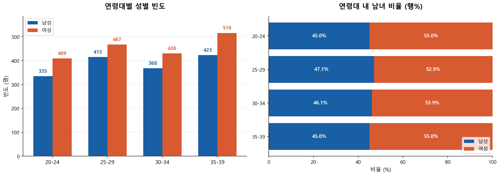
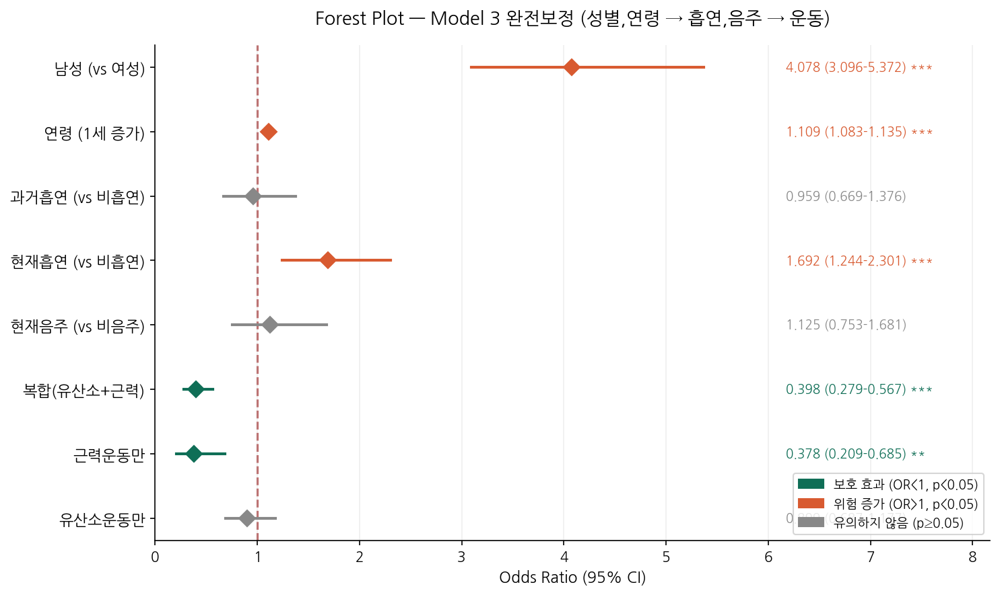
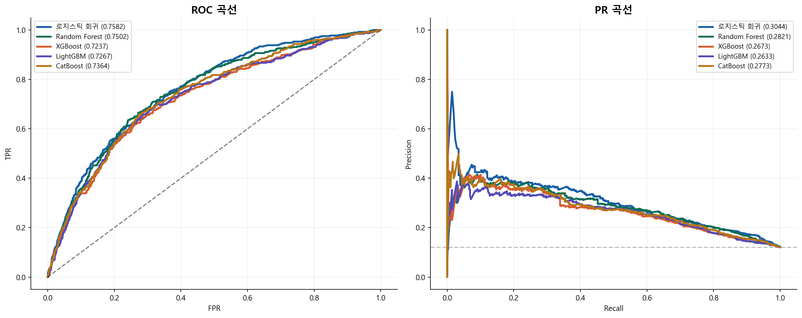
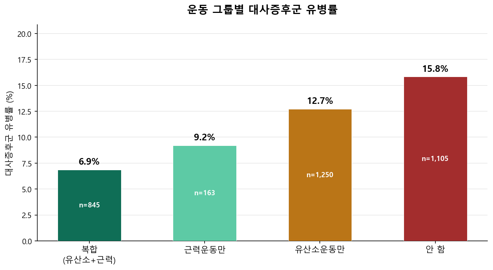
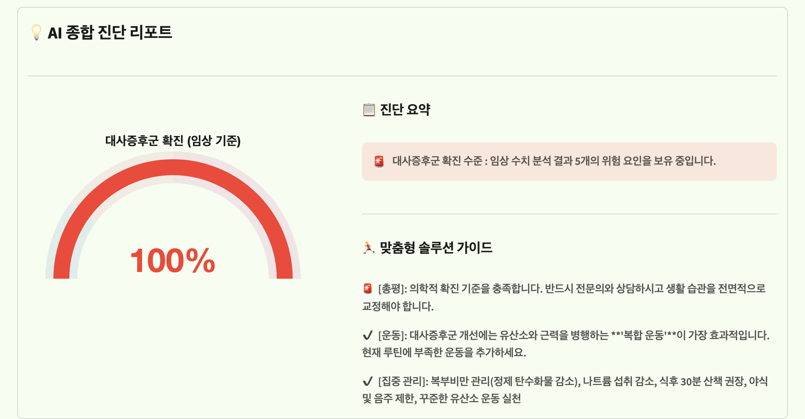

# 🩺 KNHANES 기반 청년층 대사증후군 위험 분석 및 예측

> **국민건강영양조사(KNHANES) 기반 20–39세 청년층의 생활습관 및 임상 데이터를 분석하고 대사증후군 위험을 예측한 헬스케어 데이터 프로젝트**

---

## 🎬 시연 영상

[](https://youtube.com/shorts/TcNgaddpYXQ?feature=share)

---

## 📌 프로젝트 개요

청년층(20–39세) 대사증후군 유병률이 빠르게 증가하고 있음에도 기존 관리 시스템은 중장년층 위주로 설계되어 있습니다.  
본 프로젝트는 라이프스타일(운동, 흡연, 음주)과 임상 정보를 통합하여 청년층 맞춤형 대사증후군 위험도를 예측하고, Streamlit 웹 인터페이스로 제공합니다.

| 항목 | 내용 |
|------|------|
| 데이터 출처 | 국민건강영양조사(KNHANES) 제9기 (2022–2024) |
| 분석 대상 | 20–39세 청년층 N=3,363명 |
| 학습 데이터 | SMOTE 증강 후 N=4,728명 |
| 테스트 데이터 | N=673명 (학습 데이터와 분리된 20% hold-out set) |
| 최종 모델 | Tuned Logistic Regression + Isotonic Calibration |
| 성능 (Test) | ROC-AUC 0.7347 · Recall 0.6923 · F1 0.3285 |



---

## 👥 팀 구성 및 담당 역할

| 항목 | 내용 |
|------|------|
| 개발 기간 | 2026.04 (약 1개월) |
| 팀 구성 | 6인 팀 — 데이터 분석(DA) 2인, 기술 구현(TA) 2인이 실무 담당 |
| 담당 역할 (본인) | **DA** — 데이터 전처리(`01_data_processing.py`), 검정통계표 작성(`02_statistical_table.py`), 3단계 계층적 로지스틱 회귀 및 Forest Plot(OR) 분석(`05_forest_plot.py`)을 단독 수행 |
| 그 외 역할 | ML 모델링(`03_modeling.py`)과 Streamlit 웹 구현(`04_streamlit_app.py`)은 TA 팀원이 각 1인씩 담당 |

---

## 🗂️ 프로젝트 구조

```
.
├── data/                         # 데이터 디렉토리 (gitignore 처리)
│   ├── hn_all.csv                # 원본 KNHANES 데이터 (직접 다운로드 필요)
│   └── 0325_hn_all(med).csv      # 전처리 완료 데이터 (전처리 스크립트 실행 후 생성)
│
├── 01_data_processing.py      # [STEP 1] 원본 데이터 → 분석용 데이터셋 생성
├── 02_statistical_table.py    # [STEP 2] 기술통계 및 검정통계표 생성 (.xlsx)
├── 03_modeling.py             # [STEP 3] 모델 학습, 평가, SHAP 분석 (Google Colab)
├── 04_streamlit_app.py        # [STEP 4] 웹 서비스 구현
├── 05_forest_plot.py          # [STEP 5] 계층적 로지스틱 회귀 OR Forest Plot
│
├── results/                   # README에 삽입된 결과 차트 (EDA, 모델 비교, Forest Plot)
├── requirements.txt
└── README.md
```

---

## ⚙️ 실행 방법

### 사전 준비

KNHANES 원본 데이터는 [질병관리청 국민건강영양조사](https://knhanes.kdca.go.kr) 에서 직접 다운로드 후 `data/` 폴더에 위치시켜야 합니다.

```bash
pip install -r requirements.txt
```

### 1단계: 데이터 전처리

```bash
python 01_data_processing.py
```

- 20–39세 필터링, 약물 복용군 포함(약물 보정 방식)
- 연속형 변수 윈저화(상하위 1%), 가중치 정규화
- 운동그룹 / 흡연상태 / 음주상태 파생변수 생성
- 출력: `data/0325_hn_all(med).csv`

### 2단계: 검정통계표 생성

```bash
python 02_statistical_table.py
```

- 복합표본 가중치(`wt_itvex`) 적용
- 연속형: 가중 t-검정 / 범주형: 카이제곱 검정
- 출력: `data/hn_all_검정통계표.xlsx`

### 3단계: 모델 학습 (Google Colab 권장)

`03_modeling.py`를 Google Colab에서 실행합니다.

```
Google Colab → 공유 드라이브 경로 설정 → 전체 실행
```

> ⚠️ 파일 상단 `load_and_setup_data()`의 `base_path`와 `ORIG_PATH`는 팀 공유 드라이브 경로로 되어 있습니다. 본인 환경의 경로로 수정한 뒤 실행하세요.

학습되는 모델: Logistic / RandomForest / XGBoost / LightGBM / CatBoost  
평가 지표: ROC-AUC, PR-AUC, Recall, F1, Brier Score, DCA

### 4단계: 웹 서비스 실행

```bash
streamlit run 04_streamlit_app.py
```

### 5단계: Forest Plot 생성 (선택)

```bash
python 05_forest_plot.py
```

> ⚠️ 파일 상단 `DATA_PATH`는 개인 Google Drive 경로로 되어 있습니다. 본인 환경의 `0325_hn_all(med).csv` 경로로 수정한 뒤 실행하세요.

- 3단계 계층적 로지스틱 회귀(Model 1→2→3) 각 변수의 OR을 Forest Plot으로 시각화
- Model 3 전체 변수 Forest Plot, 모델별 적합도 변화 + 운동 그룹 OR, 성별 층화 비교 등 3종 차트 생성

---

## 🔬 핵심 방법론

### 데이터 설계

- **대사증후군 진단 기준**: 대한비만학회 NCEP-ATP III 기준 (5개 구성요소 중 3개 이상)
  - 복부비만(허리둘레), 고중성지방혈증, 저HDL콜레스테롤, 고혈압, 고공복혈당
- **약물 보정**: 고혈압·이상지질혈증·당뇨 약복용자를 해당 구성요소 '이상'으로 판정
- **클래스 불균형 보정**: 학습 데이터에 SMOTE 적용 (0:1 비율 1:1 균등화, 적용 후 5개 모델 전반에서 Recall 상승 확인 → 최종 모델 선정 시 Recall 우선 기준의 근거)

### 모델 선정 근거

통계적 설명력 확보를 위해 머신러닝 모델링 전 **3단계 계층적 로지스틱 회귀(LRT 검정)** 수행:

| 모델 | 추가 변수 | LRT p-value |
|------|-----------|-------------|
| Model 1 | 연령, 성별 | N/A |
| Model 2 | + 흡연, 음주 | 0.0001 |
| Model 3 | + 운동그룹 | < 0.0001 |

운동 그룹의 독립적 연관성 확인 → 핵심 예측 변수로 확정

`05_forest_plot.py`에서는 동일한 3단계 구조를 KNHANES 표본가중치(`freq_weights`)와 PSU 단위 cluster-robust 표준오차로 재추정해 OR을 확인합니다. 다른 변수를 보정한 상태에서 복합운동군의 대사증후군 odds는 운동을 하지 않는 군 대비 약 60% 낮게 나타났습니다(OR 0.40, 95% CI 0.28–0.57, p<0.001). 관찰연구 기반 분석이므로 인과관계로 해석하지 않았습니다.

> ⚠️ 표본가중치 적용과 PSU cluster-robust covariance는 반영했지만, 층화(`kstrata`)까지 포함하는 완전한 survey-design 분석은 아닙니다. `02_statistical_table.py`의 가중 t-검정·카이제곱 검정 역시 같은 이유로 탐색적 검정으로 해석했습니다.



### 최종 모델 성능

| 구분 | 값 |
|------|----|
| ROC-AUC | 0.7345 |
| Survey-weighted ROC-AUC | 0.7323 |
| Recall | 0.6923 |
| F1 | 0.3285 |

> 아래는 하이퍼파라미터 튜닝 이전, 5개 후보 모델의 ROC/PR 곡선 비교입니다. 로지스틱 회귀가 이 단계에서도 가장 우수해 최종 모델로 선정 후 튜닝을 진행했습니다.



---

## 📊 주요 분석 결과

- **성별·연령**: 5개 모델 공통 1순위 예측 변수 (SHAP 일관)
- **운동 효과**: 복합운동(유산소+근력) 그룹 유병률 8.3% vs 미실천 그룹 16.4% (약 2배 차이)
- **흡연**: 현재흡연 OR 1.80 (비흡연 대비 odds 약 79.9% 높음, p<0.001)
- **음주**: p=0.289로 유의하지 않음 (J-curve 현상 및 금주자 편향 영향)



---

## 🌐 Streamlit 웹 서비스

사용자 입력 흐름:

```
라이프스타일 입력 (연령·성별·흡연·음주·운동)
    ↓
임상 정보 선택 입력 (허리둘레·혈압·혈당·중성지방·HDL·약복용 여부)
    ↓
AI 예측 위험도 + 임상 기준 위험 요인 병합
    ↓
대사증후군 위험도(%) + 맞춤형 솔루션 가이드 출력
```

- 임상 정보 미입력 시: ML 모델 예측 확률만 표시
- 임상 기준 위험 요인 3개 이상 해당 시: 무조건 100%(확진 수준) 표시



---

## 🔧 트러블슈팅

### 1) 약물 복용군 처리 방식 결정 — 배제 vs 보정

**문제**: 고혈압·이상지질혈증·당뇨 약을 복용 중인 사람은 약물 효과로 검사 수치가 정상 범위에 들어오는 경우가 많습니다. 원본 수치만으로 대사증후군을 판정하면 실제로는 위험군인 사람을 정상으로 오분류하게 됩니다.

**시도**: 약물 복용군을 진단 기준 산정에서 제외하는 방식과, 전원을 포함하되 약물 복용 시 해당 구성요소를 자동으로 '이상'으로 판정하는 방식(약물 보정)을 각각 전처리해서 비교했습니다.

**결정**: 약물 보정 방식을 채택했습니다. 표본을 잃지 않으면서, 치료 중인 사람도 실질적인 위험군으로 반영하는 것이 임상적으로 더 타당하다고 판단했습니다. `01_data_processing.py` STEP 4-4에 약물 보정 매핑(`DI1_2`→`ms_bp`, `DI2_2`→`ms_tg`/`ms_hdl`, `DE1_31`·`DE1_32`→`ms_glu`)으로 남아 있습니다.

### 2) 연속형 변수 전처리 방식 시행착오

**문제**: 허리둘레·혈압·혈당·중성지방·HDL 같은 임상 수치는 극단치가 섞여 있어, 어떻게 다듬어야 통계 검정과 모델 성능 양쪽에서 무리가 없을지 바로 정해지지 않았습니다.

**시도**: 윈저화 적용 전/후, 음주 변수를 다범주로 둘지 이분화할지 등 여러 버전을 각각 만들어 검정통계표 결과를 비교하며 최종 방식을 결정했습니다.

**결정**: 연속형 변수는 상·하위 1% 윈저화, 음주는 '월 1회 이상 현재 음주 여부'로 이분화하는 방식으로 정착했습니다(`01_data_processing.py` STEP 4-3, STEP 5).

---

## 💡 프로젝트 경험

**임상 기준의 데이터 로직 전환**
NCEP-ATP III 대사증후군 진단 기준과 약물 복용 여부를 판정 규칙(`ms_wc`, `ms_tg`, `ms_hdl`, `ms_bp`, `ms_glu`)으로 코드화하여, 임상 지식을 분석 가능한 파생변수로 변환했습니다.

**KNHANES 가중 분석 설계**
국민건강영양조사의 표본 가중치를 기술통계(`DescrStatsW` 가중 t-검정) 및 카이제곱 검정에 적용하고, 로지스틱 회귀에는 `freq_weights`와 PSU 단위 cluster-robust covariance(`cov_type='cluster'`)를 적용했습니다. 다만 층화(`kstrata`)까지 포함하는 완전한 survey-design 분석은 아니라는 점을 인지하고, 검정 결과를 탐색적 수준으로 해석했습니다.

**가설 검증을 통한 변수 효과 분석**
연령·성별 → 흡연·음주 → 운동그룹을 순차적으로 추가하는 3단계 계층적 로지스틱 회귀로 모델 적합도 변화와 OR을 비교하고, Forest Plot으로 시각화해 통계적 근거를 가진 핵심 예측 변수를 팀에 제시했습니다.

---

## 📖 변수 정의 (데이터 사전)

<details>
<summary>전체 변수 정의 펼쳐보기</summary>

### 기본 인구학적 변수

| 변수명 | 설명 | 내용 |
|---|---|---|
| `sex` | 성별 | 1=남자, 2=여자 |
| `age` | 나이 | 만 나이(세), 20~39세만 사용 |

### 복합표본설계 변수

| 변수명 | 설명 | 내용 |
|---|---|---|
| `wt_itvex` | 건강설문·검진조사 가중치 | 복합표본 분석용 원본 가중치 |
| `w_norm` | 정규화 가중치 (파생) | `wt_itvex`를 표본 수에 맞춰 정규화 |
| `kstrata` | 층화변수 | 복합표본설계 층화 |
| `psu` | 1차 추출단위 | 복합표본설계 집락(PSU) |

### 운동 관련 변수

| 변수명 | 설명 | 내용 |
|---|---|---|
| `BE5_1` | 1주일간 근력운동 일수(원시) | 1~6=0~5일 이상, 8/9=비해당·무응답 → 3(2일) 이상이면 근력운동 실천 |
| `pa_aerobic` | 유산소 신체활동 실천율(원시) | 0=권장수준 미달, 1=충족(중강도 150분 또는 고강도 75분 이상) |
| `exercise_group` | 운동 그룹 분류(파생) | 1=복합(근력+유산소), 2=근력만, 3=유산소만, 4=둘 다 안 함 |

### 대사증후군 관련 변수

| 변수명 | 설명 | 측정단위 | 이상 기준 |
|---|---|---|---|
| `HE_wc` | 허리둘레(원시) | cm | 남 ≥90, 여 ≥85 |
| `HE_TG` | 중성지방(원시) | mg/dL | ≥150 |
| `HE_HDL_st2` | HDL 콜레스테롤(원시) | mg/dL | 남 <40, 여 <50 |
| `HE_sbp` | 수축기혈압(원시) | mmHg | ≥130 |
| `HE_dbp` | 이완기혈압(원시) | mmHg | ≥85 |
| `HE_glu` | 공복혈당(원시) | mg/dL | ≥100 |

| 변수명 | 설명 | 판정 기준(파생, 약물 보정 포함) |
|---|---|---|
| `ms_wc` | 복부비만 | `HE_wc` 기준 초과 |
| `ms_tg` | 고중성지방혈증 | `HE_TG`≥150 또는 이상지질혈증 약 복용(`DI2_2`) |
| `ms_hdl` | 낮은 HDL 콜레스테롤 | `HE_HDL_st2` 기준 미달 또는 이상지질혈증 약 복용(`DI2_2`) |
| `ms_bp` | 높은 혈압 | `HE_sbp`/`HE_dbp` 기준 초과 또는 고혈압 약 복용(`DI1_2`) |
| `ms_glu` | 높은 공복혈당 | `HE_glu`≥100 또는 인슐린·혈당강하제 사용(`DE1_31`/`DE1_32`) |
| `metabolic_syndrome` | 대사증후군 최종 판정 | 위 5개 구성요소 중 3개 이상 |
| `ms_count` | 대사증후군 구성요소 개수 | 0~5점 |

### 약물 복용 관련 변수

| 변수명 | 설명 | 내용 |
|---|---|---|
| `DI1_2` | 혈압조절제 복용 | 1~4=복용, 5=미복용, 8/9=비해당·무응답 |
| `DI2_2` | 이상지질혈증약 복용 | 1~4=복용, 5=미복용, 8/9=비해당·무응답 |
| `DE1_31` | 인슐린 주사 투여 | 0=아니오, 1=예 |
| `DE1_32` | 당뇨병약 복용 | 0=아니오, 1=예 |

### 흡연 관련 변수

| 변수명 | 설명 | 내용 |
|---|---|---|
| `BS3_1` | 일반담배(궐련) 흡연(원시) | 1,2=현재, 3=과거, 8=비해당(평생비흡연) |
| `BS12_47` | 궐련형 전자담배 흡연(원시) | 1,2=현재, 3=과거, 8=비해당 |
| `BS12_2` | 액상형 전자담배 현재사용(원시) | 1=예, 8=비해당 |
| `smoking_status` | 흡연 상태(파생) | 0=비흡연, 1=과거흡연, 2=현재흡연 |

### 음주 관련 변수

| 변수명 | 설명 | 내용 |
|---|---|---|
| `BD1_11` | 1년간 음주빈도(원시) | 1=전혀 안 마심, 2~6=월1회 미만~주4회 이상 |
| `drinking_status` | 음주 상태(파생) | 0=현재비음주(`BD1_11`=1), 1=현재음주(`BD1_11`=2~6) |

### 분석 대상자 선정 기준

| 조건 | 기준 |
|---|---|
| 연령 | 20~39세 |
| 주요 변수 유효성 | 운동·대사증후군·흡연·음주 변수 결측치 없는 경우만 포함 |
| 최종 대상자 | 3,363명 |

### 윈저화(Winsorization)

`HE_wc`, `HE_TG`, `HE_HDL_st2`, `HE_sbp`, `HE_dbp`, `HE_glu` 6개 연속형 변수에 상·하위 1% 절단을 적용해 극단값 영향을 최소화했습니다(정보 손실 없이 분포만 완화).

</details>

---

## ⚠️ 한계점 및 향후 과제

**한계점**
- 설문·검진 데이터 기반으로 활동량·수면 등 실시간 데이터 미반영
- 식단 정보 미포함으로 영양 관련 케어 기능 제한
- 장기적 개선 효과 모니터링 및 공공기관 사업 연계 미비

**향후 과제**
- 스마트워치 실시간 데이터 통합으로 예측 정밀도 향상
- 고위험군 대상 보건소 등 공공기관 사업 연계
- 식단 데이터 추가 입력 및 분석으로 관리 체계 고도화

---


## 📚 참고 문헌

- 이광인. "머신러닝을 활용한 대사증후군 발생 예측 모델 개발." 고려대학교 대학원, 2026.
- 김윤성, 박영민, & 김동일 (2026). 유산소운동 및 근력운동의 규칙적인 참여가 대사건강 지표에 미치는 영향. *운동과학, 35*(1), 41-48.
- Liang M, et al. Effects of aerobic, resistance, and combined exercise on metabolic syndrome parameters. *Rev Cardiovasc Med.* 2021;22(4):1523-33.
- Myers J, et al. Physical activity, cardiorespiratory fitness, and the metabolic syndrome. *Nutrients.* 2019;11(7).

---

## 📄 라이선스

본 프로젝트는 학술 및 교육 목적으로 작성되었습니다.  
KNHANES 원본 데이터는 [질병관리청 이용 정책](https://knhanes.kdca.go.kr)을 따릅니다.
